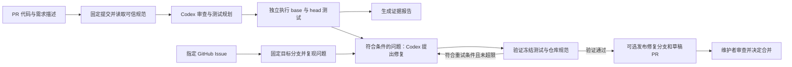

# RepoPilot

**基于 OpenAI Codex SDK、以独立验证驱动的自动化迭代 Agent，可部署在自己的机器上。**

[English](README.md) · [架构说明](docs/ARCHITECTURE.md) · [测试环境](docs/TEST-ENVIRONMENTS.md) · [安全边界](SECURITY.md)

RepoPilot 将 GitHub Issue 与 PR 转化为“生成测试 → 复现问题 → 修复代码 → 独立验证”的有限轮次迭代流程。项目使用 Codex 审查仓库规范、生成需求测试和提出修复，再由独立 Docker 执行器验证代码。验证通过后，控制器可以建立修复分支和草稿 PR，由维护者决定是否合并。

## 解决什么问题？

已有测试全部通过，并不代表新增需求、异常输入和边界情况都已覆盖。维护者还需要检查项目约定、复现问题，以及确认修复没有破坏已有行为。RepoPilot 将这些步骤组织成可重复执行、可追溯的流程。

| 维护中的问题 | RepoPilot 的处理方式 |
| --- | --- |
| Issue 描述了问题，却没有回归测试 | Codex 根据 Issue 原文提出测试，稳定复现失败后才进入修复。 |
| PR 引入了已有测试没有覆盖的行为 | Codex 根据需求描述和代码生成新测试，执行器对比 base 与 head 的结果。 |
| AGENTS.md 中的项目规范容易被遗漏 | 静态规则与 Codex 语义审查读取可信基线规范，结论附规则原文和代码证据。 |
| 修复建议缺乏可复现的验证 | 修复前冻结测试；候选代码必须保留相同用例，并通过独立执行及规范复查。 |
| 环境异常或不稳定测试被误当成代码缺陷 | 环境异常有限重试；重复结果不稳定或证据不完整时，阻止自动修复。 |
| 日志、测试结果和修复补丁分散 | JSON 与 Markdown 报告集中保存问题、用例结果、修复尝试和发布状态。 |

## 适合哪些用户？

- **开源项目维护者**：希望辅助审查同仓库 PR、核对贡献规范，并补充回归测试证据。
- **中小型研发团队**：希望补充测试覆盖并获得修复建议，同时自行掌握运行环境和合并决策。
- **测试与研发效能工程师**：维护 JavaScript、Python、Go 或 Java 测试、Monorepo，以及依赖数据库或 Redis 的测试环境。
- **基于 Codex 开发工具的开发者**：希望参考 SDK 编排、结构化模型输出、独立验证和有限轮次修复的开源实现。

以上是目标用户与适用场景，不代表已经存在对应客户或使用规模。当前支持公开、文本型仓库；1.1.0 支持 Node、Vitest、pytest、Go 和兼容的 JUnit XML 测试证据。暂不执行 fork PR，不提供浏览器 E2E 或托管控制台。

## 与 Codex、OpenAI 的直接关系

RepoPilot 的智能审查、测试规划和修复提案直接调用 `@openai/codex-sdk`。OpenAI 官方将 Codex SDK 用于在应用和工程流程中集成 Codex；本项目使用其 TypeScript 接口完成这些任务。参见 [Codex SDK 官方文档](https://learn.chatgpt.com/docs/codex-sdk)。

具体实现可以直接查看源码：

- [Agent 入口](src/adapters/codex/entry.ts)：通过 `OPENAI_API_KEY` 初始化 `Codex`，建立线程，并使用 `thread.run()` 和 JSON Schema 获取结构化结果。
- [Codex 容器适配器](src/adapters/codex/docker-agent.ts)：提供按范围整理的代码上下文，管理调用次数及模型返回的 Token 用量。
- [验证流程](src/application/pipeline.ts)：校验模型提案，在独立执行器中验证测试，决定是否接受修复及进入发布流程。

| Codex 负责 | RepoPilot 控制器负责 |
| --- | --- |
| 理解自然语言规范，给出带引用的问题发现 | 从固定 base 提取可信规范，对比历史问题 |
| 为需求与边界情况设计测试 | 冻结测试，并在固定代码快照中执行 |
| 提出生产代码修复 | 检查受保护路径、验证候选代码并控制发布 |

控制器、测试执行与报告保存在自己的机器或工作节点上；模型调用仍使用 OpenAI 服务，并发送选取的仓库文本与任务上下文。本地部署不等于离线模型推理。GitHub 凭据保留在控制器中。项目采用 MIT 许可证，是基于 Codex 构建的独立开源项目。

## 自动化迭代流程

假设某个 PR 新增输入校验规则：Codex 根据需求生成边界测试，RepoPilot 在 base 与 head 上分别执行。新需求测试在 base 失败、head 通过时，必须有 PR 需求原文支撑；已有行为在 base 通过、head 失败时，才成为回归候选。可重复的回归或符合修复条件的规范错误，才进入修复流程。



可以先运行本地 `check`，再用 `watch` 轮询 GitHub PR；需要提交已验证的修复供人工审查时，再开启 `publish`。Agent 审查、修复及发布分别配置，示例配置默认关闭这三项。

处理 Issue 时，通过 `fix --issue 123 --config config.local.json` 指定问题：先确认原始测试基线通过，再用新增的冻结测试稳定复现，随后尝试修复。迭代受尝试次数、调用次数及超时约束；证据不足时停止并转人工检查。Issue 由维护者指定，项目不会自行决定产品路线或自动合并代码。

## 已实现的代码功能

**1.1.0** 已包含 [Issue → 测试复现 → 修复 PR](docs/ISSUE-REPAIR.md)、[pytest、Go test 与 JUnit XML](docs/MULTILINGUAL-TESTS.md) 和[崩溃恢复](docs/RECOVERY.md)。下载包与 Agent 镜像应使用匹配的 1.1.0 版本。

- GitHub 轮询和本地提交比较；任务固定 base/head SHA、PR 标题及描述摘要。
- 从 base 读取规则，支持嵌套 AGENTS.md、静态文本规则、JS/TS AST 调用规则、规则冲突检查、历史问题去重及带有效期的规则豁免。
- 语义结论必须引用可信规范原文和对应代码证据。
- 根据 PR 需求主动生成测试计划和新测试文件；生成后冻结，修复阶段不能改动。
- Node、Vitest、pytest、Go 和兼容 JUnit XML 的结构化用例解析；零测试、全跳过、报告异常不能算通过。
- 子目录与 Monorepo 多命令测试，支持 Redis、数据库等临时依赖服务、就绪检查和异常清理；详见[测试环境配置](docs/TEST-ENVIRONMENTS.md)及[示例](examples/monorepo.json)。
- 使用文件路径和完整用例名定位测试，重复失败指纹一致才进入回归修复；修复后核验相同用例通过。
- 检查原始基线用例是否被删除、跳过或隐藏；拒绝通过修改测试、配置和规范来修复。
- 活跃任务过期检测、取消传递到子进程、任务总超时、模型调用次数与返回 Token 用量预算。
- 临时错误有限重试、持久化执行次数、重试退避、失败执行归档。
- 区分测试失败、环境异常、测试未执行和无效报告；环境异常按阶段有限重试，重复失败不稳定或用例缺失时阻止自动修复。
- GitHub 发布前重新校验输入，保留文件可执行权限，验证已有修复分支/PR 是否匹配本次证据。
- JSON 完整报告和 Markdown 摘要，记录测试计划、每次执行、修复候选及拒绝原因。

## 启动

直接使用可下载 [1.1.0 便携包](https://github.com/indada/repopilot/releases/tag/v1.1.0)，支持 Linux、Windows、macOS，内置 Node.js，无需 npm 安装。参见[便携版快速入门](docs/QUICKSTART.md)。以下为源码安装方式。

需要 Node.js 22、Git，以及用于执行目标测试和 Agent 的 Linux Docker 容器。

```powershell
npm ci
npm run check
npm test
npm run build
Copy-Item repopilot.example.json config.local.json
```

修改 repository、测试镜像和命令：

```powershell
npm run dev -- check --config config.local.json --repo D:/projects/example --base main --head feature
npm run dev -- watch --config config.local.json --once
```

check 不修改源工作区、不发布 GitHub 内容。watch 持续或单次轮询；publish 开启时才发布修复 PR。控制器配置放在受审查快照之外。

默认使用 runner.reporter=node 和 node --test。Vitest 需要设置 reporter=vitest，命令使用可信镜像中已安装的 vitest run；依赖须预装在镜像中。测试默认无网络，配置依赖服务后使用临时内部 Docker 网络，具体边界见[测试环境说明](docs/TEST-ENVIRONMENTS.md)。reporter=command 仅收集命令输出，不能用于验证或发布。先执行 npm run build，生成可信 Node reporter。

## Codex 与凭据

```powershell
docker build -f Dockerfile.agent -t repopilot-agent:local .
```

OPENAI_API_KEY 只传给 Agent 容器；GITHUB_TOKEN 或 GH_TOKEN 留在控制器。使用 API 认证，不复用桌面 ChatGPT 登录凭据。

agent.enabled 开启语义审查和测试规划；agent.repair 开启有限轮次修复；publish 开启验证后发布。模型不获取 GitHub 写入凭据，也不直接操作原仓库。

## 自动修复判定

原始基线测试必须通过。新测试按场景标注 regression（保留已有行为）或 new_behavior（新增行为），两类使用独立测试文件。新增行为必须引用 PR 标题或描述中的需求原文，缺省场景类型按回归处理。

| 基线用例 | 变更用例 | 判定 |
| --- | --- | --- |
| 通过 | 通过 | 行为保持正常 |
| 通过 | 失败 | 回归，重复失败用例及指纹一致后允许修复 |
| 失败 | 通过 | 有需求原文支撑的新增行为可以通过；回归场景仍需人工处理 |
| 失败 | 失败 | 无法区分实现未完成或测试有误，转人工处理 |

两边必须执行同一组生成用例；跳过、缺失、加载错误或新测试改变原有用例结果，均不能放行。新增接口应在测试用例内部检查导入结果，不能用顶层导入失败替代断言证据。模型给出的场景标签不会独自决定通过。

同一个 PR 可以同时包含已验证的新增行为和待修复回归。修复候选必须让原始基线、原始 head 和全部冻结测试继续通过，且规范复查没有新增错误。JSON/Markdown 报告保存场景类型、需求引用和逐用例判定。测试全部通过但存在可定位的规范错误，也可以尝试修复并独立复查。

修改规范的 PR 一律人工处理，使用 base 规范不会被 PR 中的修改覆盖。AST 规则支持直接调用及字符串属性访问，不做跨文件符号解析；自然语言冲突仍需人工判断。

## 配置和运行记录

参考 [配置示例](repopilot.example.json)、[规则示例](examples/policy.json) 和 [架构说明](docs/ARCHITECTURE.md)。

结果保存在 .repopilot-data 下的任务 JSON 和 Markdown 中。重试前把上一执行保存为 任务ID.execution-次数.json。任务结束后可复用终态报告；输入变更会产生新任务。

maxCalls 限制每次任务执行的模型调用数量。maxTokens 根据每次模型返回的用量累计，超限阻止后续调用；单次调用可能越过阈值，它不是预付费额度或金额硬上限。maxTaskExecutions 同时限制崩溃恢复和临时错误重跑。

## 任务管理 CLI

1.1.0 提供 `recover`：先预览，再校验预览令牌清理当前数据目录所属的遗留资源，并保留中断任务证据。参见[崩溃恢复说明](docs/RECOVERY.md)。

```powershell
npm run dev -- tasks list --config config.local.json --status running --limit 20 --offset 0
npm run dev -- tasks show 任务ID --config config.local.json --format markdown
npm run dev -- tasks cancel 任务ID --config config.local.json
npm run dev -- tasks resume 任务ID --config config.local.json
npm run dev -- tasks rerun 任务ID --config config.local.json
```

- list：分页列出当前配置仓库的任务，支持状态筛选，并单独显示取消请求。
- show：查看 JSON（默认）或 Markdown 报告。
- cancel：提交持久取消请求，运行中的控制器约每 250 ms 检查并传递给执行器及发布请求。可以在控制器持锁时调用；返回表示请求已登记，最终状态以报告为准。已完成的远端写入不会撤销。
- resume：在相同配置、相同提交及执行次数上限内恢复中断/取消/可重试错误任务；验证阶段从头执行，已验证任务只继续发布。仍遵守重试等待时间。永久错误、终态或预算耗尽须使用 rerun。
- rerun：使用原任务固定提交和当前配置，建立带 rerunOf 关联的新任务，保留原任务报告和取消请求。不会读取分支的新 HEAD。

查看与取消不占写锁；恢复、重跑必须先停止正在运行的控制器。崩溃遗留锁仍须确认旧进程停止后清理。取消只针对指定任务，输入变化形成的新任务不继承取消状态。

任务保存本地仓库路径、提交和描述供重放，源码仓库或 watcher 的 git-cache 必须仍存在。PR 重放前及执行中重新核验输入；PR 已更新时用 watch 检查新版本。旧报告缺少重放信息时，再运行一次原 check/watch 可补录。恢复不会跳过测试或直接采信上次未完成的验证。

## 当前边界

项目处于开发预览阶段，当前验证范围与回归覆盖见[验证记录](docs/VERIFICATION.md)，执行边界见[安全说明](SECURITY.md)。

当前处理公开、文本型仓库中的指定 Issue 与同仓库 PR；不自动执行 fork PR。二进制、符号链接、子模块及大小写冲突路径会报错。单控制器串行执行；崩溃后使用恢复预览及令牌校验流程，旧版锁和资源仍须人工核验。没有 Web 界面、分布式队列、浏览器 E2E、自动安装依赖或自动合并。

报告可能包含代码和日志，请按项目的数据保留要求管理。JSON 保留完整的受大小限制输出，Markdown 和 PR 展示截短摘要。独立开源项目，非 OpenAI 官方产品。
